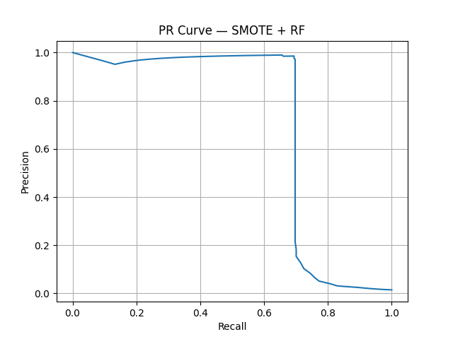
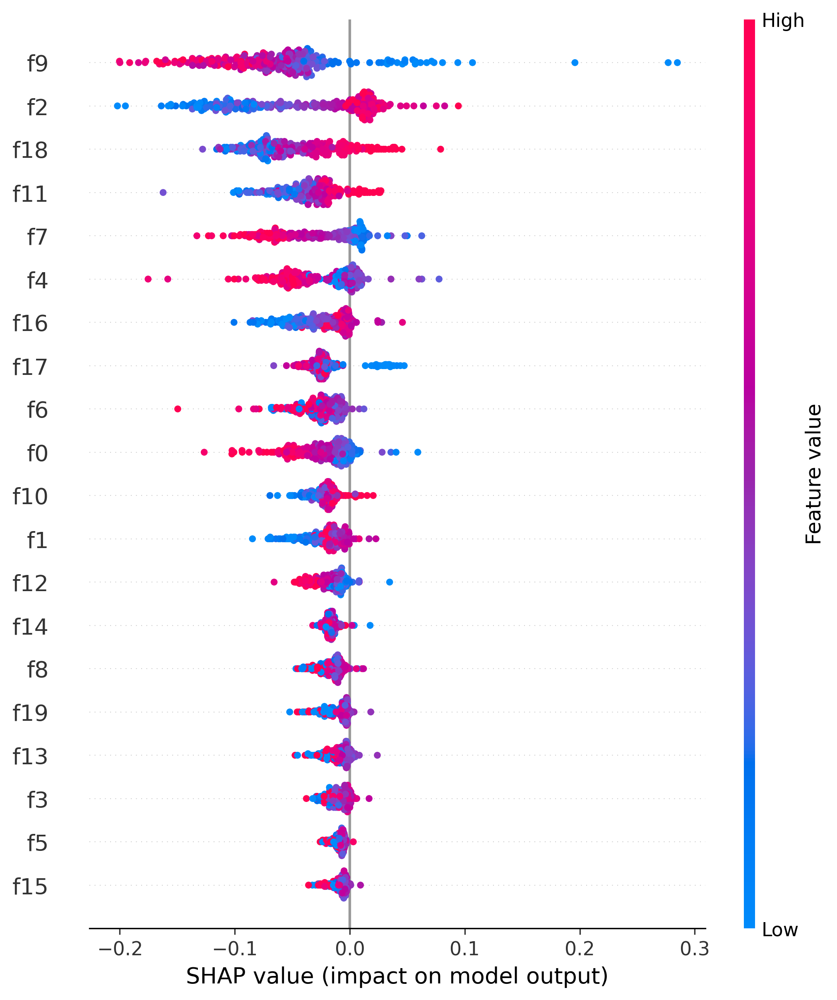

# 🛡️ Credit Card Fraud Detection (Imbalanced Classification)

A compact ML pipeline for detecting fraud in a **highly imbalanced dataset (1% fraud)**.  
This project demonstrates the correct workflow for handling imbalance, evaluating models with PR-AUC, and interpreting results using SHAP.

---

## 📂 Project Structure

```
credit-card-ml/
│── .gitignore
│── main.py
│── requirements.txt
│── pr_curve.png
│── shap_summary.png
└── README.md
```

---

## 📊 Dataset

The project uses a **synthetic fraud dataset** generated with `make_classification`:

- 100,000 samples  
- 20 features  
- 1% fraud  
- 10 informative + 5 redundant features  

**Target labels:**

```
0 = legit  
1 = fraud
```

---

## 🤖 Models Used

- **Baseline Random Forest**  
- **Weighted Random Forest (`class_weight="balanced"`)**  
- **SMOTE + RandomForest Pipeline**  
- **XGBoost Classifier**  
- **LightGBM Classifier**  
- **GridSearchCV-tuned RandomForest**  

These models are evaluated using **PR-AUC**, the most reliable metric for rare-event classification.

---

## 📈 PR Curve (SMOTE + RandomForest)



---

## 🔍 SHAP Summary Plot (Feature Importance)



---

## ▶️ How to Run

Install dependencies:

```
pip install -r requirements.txt
```

Run the project:

```
python main.py
```

This will:

- Train all models  
- Evaluate them  
- Generate PR curve (`pr_curve.png`)  
- Generate SHAP summary plot (`shap_summary.png`)

---

## 📈 Example Output (varies)

```
Baseline RF PR-AUC: 0.69
Weighted RF PR-AUC: 0.69
SMOTE + RF PR-AUC: 0.68
XGBoost PR-AUC: ~0.71
LightGBM PR-AUC: ~0.72

=== BEST GRIDSEARCH MODEL ===
{'model__n_estimators': 400, ...}
```

Boosted models (XGBoost, LightGBM) typically perform best.

---

## 🧠 Key Learnings

- SMOTE must be used **inside a Pipeline** to prevent data leakage  
- **PR-AUC** is the correct metric for fraud detection  
- Weighted models help, but **boosted models outperform classic RF**  
- SHAP visualizations improve model explainability for audits  

---

